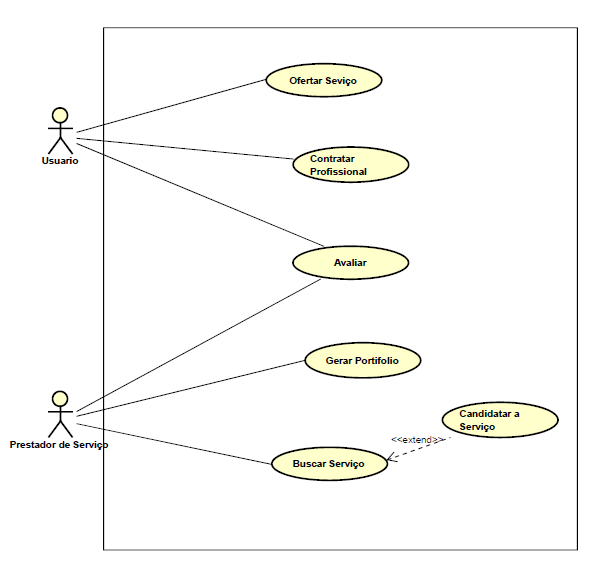
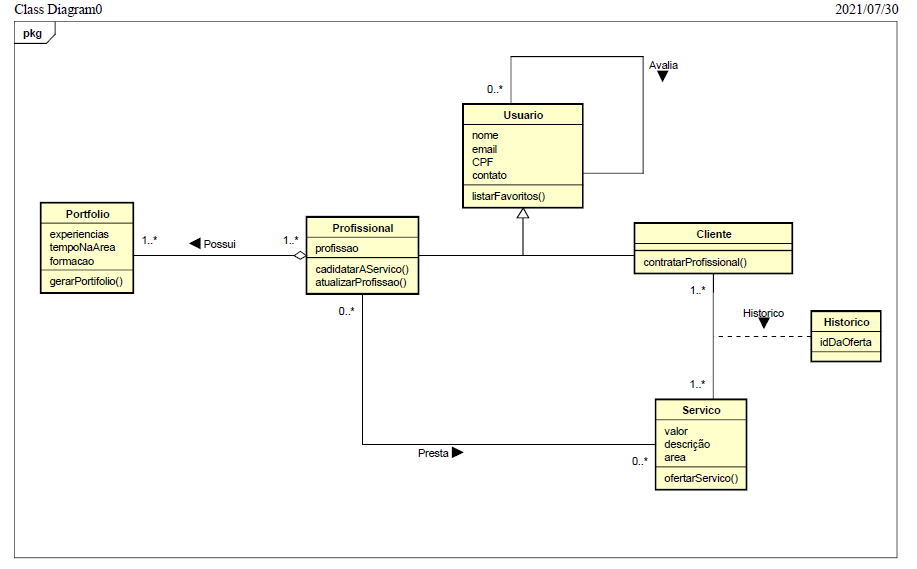
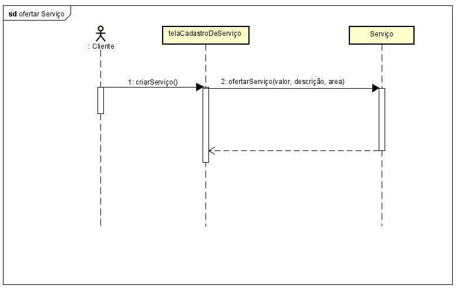

# JobsApp
App para a disciplina de projeto e desenvolvimento de software - UFMA

## Discentes:
<ul>
<li>Clebson Mendonça Machado da Silva</li>
<li>Luiz Felipe Silva Santos</li>
<li>Salma Ferreira de Sousa</li>
<li>Vinícius Santos do Nascimento</li>
</ul>

## Proposta inicial para o aplicativo

Portal de anúncio e contração de serviços. O principal objetivo desse sistema web é permitir encontrar de forma mais fácil diferentes
serviços oferecidos por pessoas na informalidade ou não, como eletricistas, professores particulares, organizadores de eventos e entre
outros.

O sistema deverá permitir dois tipos de cadastro, um como usuário comum e outro como prestador de serviço. O usuário poderá procurar 
diretamente um prestador de serviço específico ou fazer um pedido e esperar que algum prestador entre em contato com ele.

Depois de prestado o serviço, o contratante poderá avaliar o contratado, atribuindo notas e comentários sobre o serviço prestado.

## Como compilar e executar

### Pré-requisito

Para poder compilar os códigos fontes é necessário ter os seguintes programas instalados: 

1. [Android Studio](https://developer.android.com/studio?gclid=Cj0KCQjw4eaJBhDMARIsANhrQACRbjyRtDf7cKYBZcEUkWog9q4Wx6yUsA2fukopL87jGnEnj23wXTEaAhDTEALw_wcB&gclsrc=aw.ds)
2. [Java Development Kit](https://www.oracle.com/java/technologies/javase-jdk11-downloads.html)

### Compilando e executando

#### Obtenha o código fonte

Para obter o código fonte, clone o repositório git no próprio Android Studio.

### Tutorial para as intruções supracitadas

[Instalação do Java](https://alexsoaresdesiqueira.gitbooks.io/android-developer/content/download-do-java.html)

[Download do Android Studio](https://alexsoaresdesiqueira.gitbooks.io/android-developer/content/download-do-android-studio.html)

[Clonando um repositório do Github no Android](https://alexsoaresdesiqueira.gitbooks.io/android-developer/content/utilizando-o-github-no-android-studio.html)

## Documentação - Diagramas

### Diagrama de caso de uso

### Diagrama de classes

### Diagrama de sequência

### Diagrama de Estado
#### Obs: foi feito as opções de cadastrar e excluir uma oferta, no entanto, foi decidido que ao invés de excluir seria melhor ocultar a oferta  (ficar invisível para os outros usuário), além do estado finalizado que seria a ação final entre os dois usuários, mas como não foi implementado (ainda não) foi só adicionado a ideia no diagrama de estado.

Link para download da APK do app: https://drive.google.com/file/d/10_RgPJG3iSBcqpLAQV_7g_dcm0GIFhKF/view?usp=sharing

